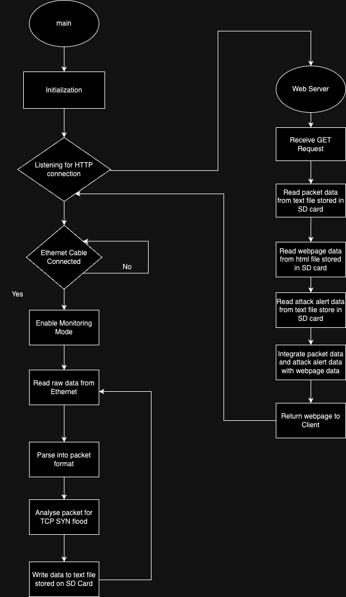

# INF2004

Code for the assignment
1. Ethernet Drivers
2. SD Card Drivers
3. Web Server

## Project Title: Raspberry Pi Pico Network Analyzer

## Project Overview:
The goal of this project is to create a network reconnaissance detection and prevention system using the Raspberry Pi Pico microcontroller board. The system will monitor network traffic, identify reconnaissance attempts, drop malicious packets, and send real-time alerts to a dashboard.

## Project Objectives:
Network Traffic Capture: Develop a network packet capture module on the Raspberry Pi Pico to capture incoming and outgoing network packets.

- Reconnaissance Detection:
Implement packet parsing and analysis functions to identify patterns indicative of network reconnaissance, such as repeated port scanning, unusual traffic patterns, or multiple failed login attempts.

- Malicious Packet Dropping: Develop mechanisms to drop packets associated with reconnaissance attempts or known malicious patterns, preventing them from reaching their intended targets.

- Real-time Alerting: Integrate the Pico with a dashboard or monitoring system to send real-time alerts when reconnaissance attempts are detected. Alerts should include information about the source IP, type of reconnaissance, and timestamp.

- Dashboard Integration: Create a dashboard or web-based interface where alerts from the Pico can be visualised and monitored. The dashboard should provide real-time and historical data on detected reconnaissance activities.

- Logging and Reporting: Implement logging functionality to record all network activities, including reconnaissance attempts and dropped packets. Generate reports summarising security incidents for later analysis.

## Project Components:
### Network Interface Capabilities - Ethernet Driver Development:
- Develop an Ethernet driver for the Raspberry Pi Pico, which includes low-level software components to interface with the Ethernet hardware.
- Ensure the driver supports communication through Ethernet, including sending and receiving Ethernet frames.
- This driver should provide a stable and efficient interface for interacting with the Ethernet hardware on the Pico.
### SD Card Capabilities - SD Card Driver Development:
- Create an SD card driver for the Raspberry Pi Pico to interact with an SD card.
- Implement read and write functions to access and store data on the SD card.
- This driver is essential for creating storage space for storing reports or captured network data.
### Packet Capture:
- Develop code to capture network packets from the connected network.
- This may involve using a library or API to access the network interface and capture incoming and outgoing packets.
- Captured packets are typically stored in memory or written to a storage device for further analysis.
### Packet Parsing and Analysis:
- Implement packet parsing and analysis functions to extract relevant information from the captured packets.
- Extract data such as source and destination IP addresses, port numbers, and payload contents.
- This step is crucial for understanding the contents and context of network traffic.
### Network Monitoring/Alerting Features:
- Implement network monitoring features, which may include packet counting, detecting specific packet types, or logging network events.
- Create rules or filters for identifying specific packet patterns or behaviours.
_ Implement alerting mechanisms to notify users or administrators of network events, and consider implementing security measures to block or drop malicious packets.
### Displaying and Reporting and GUI Development:
- Create a user-friendly interface for displaying network analysis results.
- Options include developing a graphical user interface (GUI) or generating reports in a readable format.
- Consider mechanisms for sending results to external devices (e.g., a computer via USB) or storing them on the SD card for later retrieval.

## Assignment of Project Components:
| Team Member | Component |
|----------|----------|
| Malcolm | SD Card Capabilities |
| Anurag | Packet Parsing |
| Edward | Intergration and UI, Network Monitoring/Alerting |
| Kenneth | Web Server, WiFi |
| Khairul | Network Interface Capabilities |

## Block Diagram

## Flow Chart
For the flow of our program, it begins with the initialization of 3 components, the SD card reader, the Ethernet driver, and the Web Server. The initialization of the SD card reader includes ____idk___. The initialization of the Ethernet driver includes ensuring that an Ethernet cable is connected and enabling monitoring mode. The initialization of the Web Server includes connecting to either a Wi-Fi or Hotspot and starting a listener on port 80 for incoming HTTP connection. 

After the initialization, in the main loop, the Pico W will be reading network data from the ethernet device, parsing the data into a format that <elaborate>, using the parsed data to detect TCP SYN flood, and writing the parsed data into the log file stored on the SD card. If a TCP SYN flood is detected, an alert will be written into an alert text file on the SD card. While the main loop is running, the Pico W will be listening on port 80 for incoming HTTP connection in the background. Once a client connects to the web server, the main loop will be interrupted and the Pico W will then read the HTML file, log file and alert file from the SD card to incorporate the data from the log and alert file into the HTML webpage and serve this webpage to the client. After serving the webpage, the Pico W then resumes the main loop.

